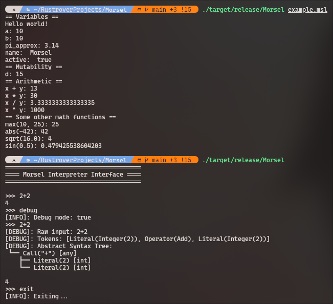

Here's your improved README with the changes applied:

<div align="center">
<h1> Morsel </h1>

</div>

> [!WARNING]
>
> Work in progress. Check [Roadmap](#roadmap)

## Introduction

**Morsel** is an **interpreted** programming language built in **Rust** as my first Rust project. It combines the
performance and memory safety of Rust with an easy, expression-based syntax inspired by C, Go, and Rust itself.

## Table of Contents

- [Quick Start](#quick-start)
- [Features](#features)
- [Getting Started](#getting-started)
- [Syntax Highlighting Setup](#syntax-highlighting-setup)
- [Language Reference](#language-reference)
- [Project Structure](#project-structure)
- [Roadmap](#roadmap)

## Quick Start

Here's a simple Morsel program:

```morsel
fn add(x: float, y: float) {
    x + y
}

fn main() {
    let first = 1;
    let second = 2;
    let result: int = add(first, second);
    println("Result:", result);
}
```

Run it with:

```bash
./target/release/Morsel examples/quickstart.msl
```

Check [complete example](#complete-example) for comments with explained code

## Features

- **Strict typing:** Declare, assign, and manipulate variables with full type safety
- **Functions:** Function support with type-safe arguments and implicit return values
- **Immutability by default:** Variables are immutable unless explicitly marked as `mut`
- **Built in Rust:** RUST🚀 RUSTRUSTRUST BLAZINGLY FAST🚀🚀 YEEEAH MEMORY SAFETY🏳️‍🌈
- **Math support:** Full support for arithmetic, trigonometric, logarithmic, and exponential functions
- **Familiar syntax:** Morsel inherits syntax from C, Rust, and Go

## Getting Started

1. **Install Rust**
   ```
   https://rust-lang.org/tools/install/
   ```

2. **Clone the repository**
   ```bash
   git clone https://github.com/bazelik-null/Morsel.git
   cd Morsel
   ```

3. **Build the project**
   ```bash
   cargo build -r  # -r for release mode (optimized)
   ```

4. **Run tests**
   ```bash
   cargo test
   ```

5. **Learn the basics**
    - Check the `examples/` directory for sample Morsel programs with comments explaining the code

    - Try different examples:
      ```bash
        ./target/release/Morsel examples/variables.msl
        ./target/release/Morsel examples/functions.msl
        ./target/release/Morsel examples/circle.msl
      ```

6. **Try the interactive CLI**

   ```bash
   ./target/release/Morsel
   ```

## Syntax Highlighting Setup

### VS Code

1. Copy `syntax_highlighting/morsel_vsc/` to your extensions folder:
    - **Windows:** `%USERPROFILE%\.vscode\extensions\`
    - **macOS/Linux:** `~/.vscode/extensions/`
2. Restart VS Code

Files with `.morsel` or `.msl` extensions will now have syntax highlighting.

### JetBrains IDEs (IntelliJ, PyCharm, WebStorm, etc.)

1. Open **Settings** -> **Plugins**
2. Ensure **TextMate Bundles** plugin is enabled
3. Go to **Settings** -> **Editor** -> **TextMate Bundles**
4. Click **Add** and select `syntax_highlighting/Morsel.tmBundle/`
5. Restart the IDE

### Sublime Text

1. Copy `syntax_highlighting/Morsel.tmBundle/Syntaxes/morsel.tmLanguage.json` to:
    - **Windows/Linux:** `%APPDATA%\Sublime Text\Packages\User\`
    - **macOS:** `~/Library/Application Support/Sublime Text/Packages/User/`
2. Restart Sublime Text
3. Select **View** -> **Syntax** -> **Morsel** to apply highlighting

**Note:** The TextMate grammar (`morsel.tmLanguage.json`) is shared across all editors for consistency.

## Language Reference

### Variables and Types

#### Variable Declaration

```
let mut name: type = value;
```

- **`mut` (optional):** Makes the variable mutable so it can be reassigned later
- **`name` (required):** Variable name. Required for variable referencing
- **`: type` (optional):** Specifies the data type. If omitted, the type is inferred (works only with literals)
- **`value` (required):** All variable declarations must include an initial value or expression

#### Available Data Types

- **Integer:** `int` - 64-bit integer
- **Float:** `float` - 64-bit floating-point number
- **String:** `string` - Text data
- **Boolean:** `bool` - Boolean value (true/false)

**Note:** `null` and `any` types exist but cannot be used for variable initialization.

#### Variable Assignment

- **Assignment:** `x = y;` - Reassign an existing variable to a new value (variable must be declared as `mut` and types
  should match)

### Functions

#### Function Declaration

```
fn name(argument: type, ...) {
    code
}
```

- **`name` (required):** Function name. Required for function calling
- **`argument: type` (optional):**
    - **`argument` (required):** Argument name. Required for variable referencing
    - **`: type` (required):** Specifies the data type. Can't be omitted
- **`...` (optional):** There can be unlimited amount of arguments separated by comma
- **`{ code }` (required):** Code which will be executed at function call

Functions return the value of their last expression implicitly.

#### Comments

```
// Single-line comment
```

### Operations

#### Arithmetic

- **Addition:** `x + y`
- **Subtraction:** `x - y`
- **Multiplication:** `x * y`
- **Division:** `x / y`
- **Modulo (remainder):** `x % y`
- **Negation:** `-x`

#### Exponents and Roots

- **Exponentiation:** `x ^ y` - Raises x to the power of y
- **Square root:** `sqrt(x)` - Returns the square root of x
- **Cubic root:** `cbrt(x)` - Returns the cube root of x
- **Nth root:** `root(x, y)` - Returns the y-th root of x

#### Logarithms

- **Logarithm:** `log(x, y)` - Logarithm with base x of argument y
- **Natural logarithm:** `ln(x)` - Logarithm with base e of x

#### Trigonometric Functions

- **Cosine:** `cos(x)`
- **Sine:** `sin(x)`
- **Tangent:** `tan(x)`
- **Arccosine:** `acos(x)`
- **Arcsine:** `asin(x)`
- **Arctangent:** `atan(x)`

#### Utility Functions

- **Absolute value:** `abs(x)` - Returns the absolute value of x
- **Rounding:** `round(x)` - Rounds x to the nearest integer
- **Floor:** `floor(x)` - Rounds x down to the nearest integer
- **Ceiling:** `ceil(x)` - Rounds x up to the nearest integer
- **Maximum:** `max(x, ...)` - Returns the largest of the given values
- **Minimum:** `min(x, ...)` - Returns the smallest of the given values
- **Print:** `println(x, ...)` - Outputs x to the console

## Complete Example

```morsel
fn add(x: float, y: float) {
    x + y // Function returns last expression result
}

// Any program must have entry point (main)
fn main() {
    // Declare some variables
    // You can provide explicit type annotation, but they're initialized with a literal so you can omit that
    let first = 1;
    let second = 2;

    // Explicit annotation required because var initialized not with a literal
    let result: int = add(first, second);
    // There is implicit conversion:
    // Arguments 'x' and 'y' are floats so function returns float
    // But return value can be converted without loss of precision
    // Also 'first' and 'second' are integers, but they're converted to floats

    // Display result
    println("Result:", result);
}
```

## Project Structure

#### Pipeline

**Morsel** evaluates expressions through a three-stage pipeline:

1. **Tokenizer (Lexer)** - Converts input string into tokens
2. **AST Builder (Parser)** - Builds an Abstract Syntax Tree (AST) from tokens
3. **Runtime (Executor)** - Executes the AST and returns a result

```
Input -> [Lexer] -> Tokens -> [Parser] -> AST -> [Executor]
```

`Interpreter` wraps this pipeline. Use `execute()` to build and execute source code. Enable debug mode to
see intermediate outputs at each stage.

#### File structure

- **Entry point** (`src/main.rs`) - Launches CLI or evaluates file from argument
- **Command Line Interface** (`src/cli/`) - User interface that accepts commands and file inputs
- **Core** (`src/morsel_interpreter/`) - Core of the Morsel interpreter
    - **Interpreter** (`src/morsel_core/mod.rs`) - Wrapper for easy code execution
    - **Tokenizer** (`src/morsel_core/lexer/`) - Tokenizes input string into an array of tokens
    - **AST Builder** (`src/morsel_core/parser/`) - Builds an Abstract Syntax Tree from tokens
    - **Environment** (`src/morsel_core/environment/`) - Manages scopes, variables and function tables
    - **Executor** (`src/morsel_core/runtime/`) - Executes AST

## Roadmap

- [x] Math expressions (x+y, x*y)
- [x] Built-in math library (sin(), round())
- [x] Variables and scopes
- [x] Type safety
- [x] Type casting
- [x] Functions
- [ ] Built-in std library (print(), input())
- [ ] Control flow (if/else statements, loops, etc)
- [ ] Arrays and data structures
- [ ] Imports
- [ ] Additional standard library functions
- [ ] Performance optimizations
- [ ] **First release**

## Screenshot

