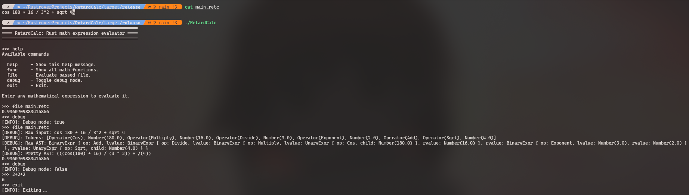

<h1> RetardCalc </h1>

# Introduction
**RetardCalc** is my first rust project which I made just for fun. Don't expect much from it.  
This project uses Abstract Syntax Tree (AST) to evaluate expressions. Proccess is pretty simple:  
1. lexer::tokenize Parses string into Tokens array.
2. parser.parse() Builds AST Nodes from Tokens and links them.
3. evaluator::eval() Evaluates AST Nodes and returns result.

# Screenshot

